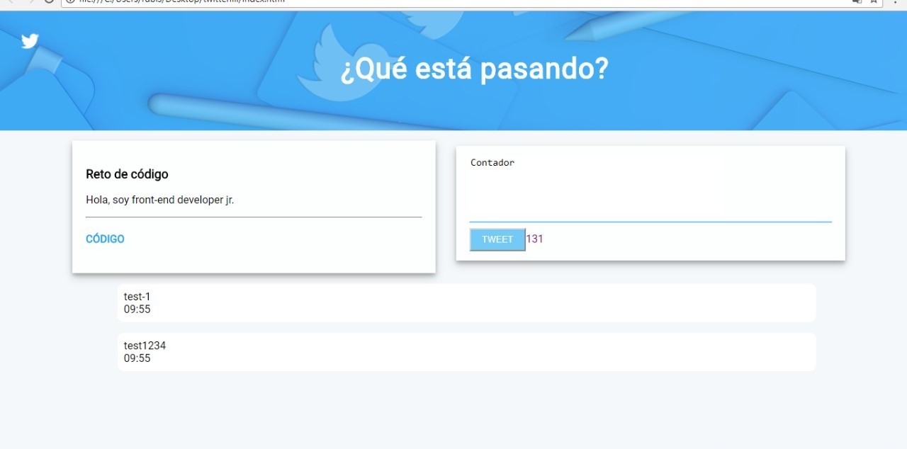

# Twitter

Replicar el newsfeed de Twitter


### Acerca de
Se replican caracteristicas basicas de twitter


### Pre-requisitos

Requiere explorador web
```
Chrome, Safari, Internet explorer...
```



### Versiones

##### Versión 0.0.1

Formulario que permita ingresar un texto y botón para "twittear".
Evento de click submit al formulario.
Obtener el texto.
Agregar el texto al HTML.


##### Versión 0.0.2

Deshabilitar el botón de "twittear" al ingresar texto vacio
Contar la cantidad de caracteres de forma regresiva.


##### Versión 0.0.3

Si pasa los 140 caracteres, deshabilitar el botón.
Si pasa los 120 caracteres, mostrar el contador con OTRO color.
Si pasa los 130 caracteres, mostrar el contador con OTRO color.
Si pasa los 140 caracteres, mostrar el contador en negativo.


##### Versión 0.0.4

Crecer el textarea de acuerdo al tamaño del texto.


##### Versión 0.0.5 (Extra)

Si la cantidad de caracteres ingresados supera al tamaño del textarea por defecto, se agrega una línea más para que no aparezca el scroll.


##### Versión 0.0.6 (Extra)

Agregar la hora en que se publicó el tweet. En el formato de 24 horas.


## < l a b o r a t o r i a >
